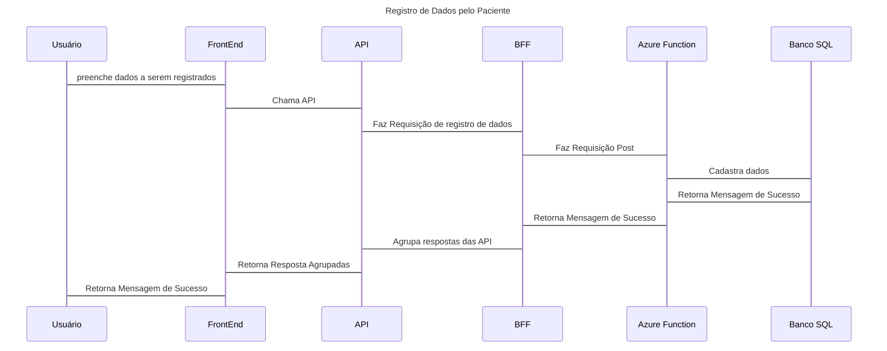
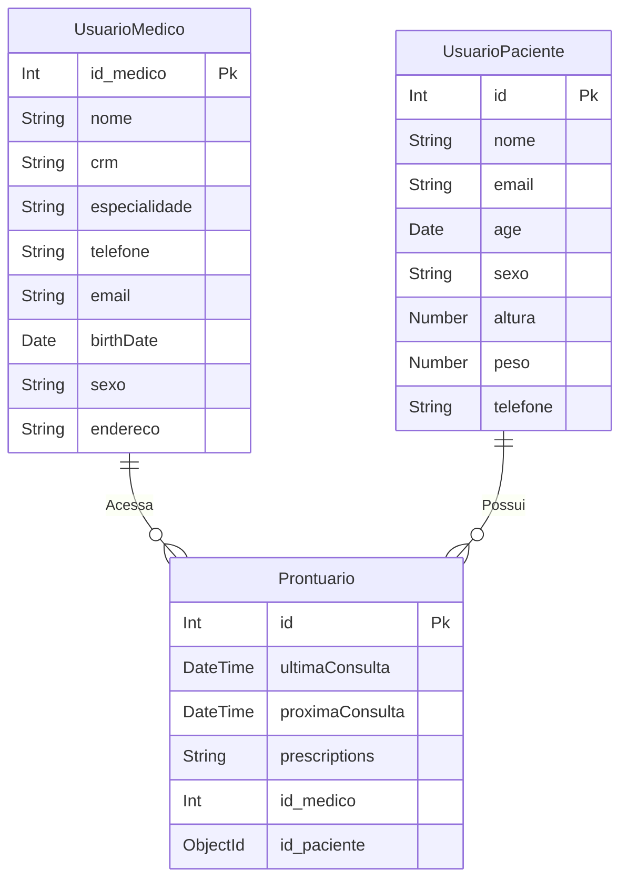
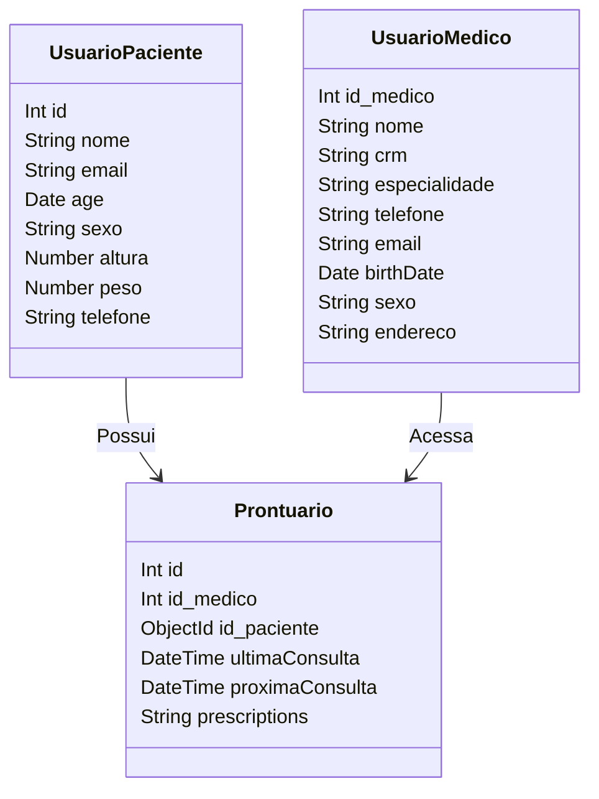

# **1\.**  **Introdução e Objetivo**

#### **1.1 Visão Geral:**

Atualmente cuidar da saúde é cada vez mais necessário devido ao ritmo acelerado que vivemos, segundo dados da pesquisa nacional de saúde mais de 60,3% da população brasileira apresenta excesso de peso. Surge então a necessidade de sistemas que auxiliam no processo de melhoria de saúde do usuário, rastreando e contabilizando dados relevantes para essa mudança de hábito junto a outras funcionalidades que possam facilitar esse processo.

#### **1.2 Objetivos:**

* **Integração Paciente-Médico**: Fornecer um meio de comunicação facilitado entre médicos para conversas sem a necessidade de marcar consultas.

* **Registro Detalhado de Informações de Saúde**: Apresentar de forma detalhada as informações registradas, fornecendo resumos e gráficos da evolução do paciente com o tempo.

* **Lembretes de Atividades:** Lembretes diários enviados ao usuário sobre a necessidade de realizar atividades, tomar água entre outros.

#### **1.3 Metas de Qualidade:**

* **Segurança dos Dados**: Assegurar a proteção dos dados pessoais e de saúde dos pacientes por meio de autenticação robusta e criptografia, em conformidade com a LGPD.  
    
* **Escalabilidade**: Garantir que o sistema suporte um número crescente de usuários, podendo ser escalado conforme a demanda aumenta, o que é facilitado pelo uso do Azure Functions e uma arquitetura orientada a microserviços.  
    
* **Disponibilidade e Confiabilidade**: O sistema deve estar disponível e operacional na maior parte do tempo para atender a usuários em diversas plataformas, como iOS, Android e navegadores web.


# **2\.**  **Restrições**

#### **2.1 Técnicas:**

* **Compatibilidade**: Suporte a múltiplas plataformas, incluindo iOS, Android, e navegadores web.  
    
* **Segurança**: Proteger dados dos usuários através de autenticação e criptografia robustas.

#### **2.2 Organizacionais:**

* **Compliance**: Cumprir regulamentações de privacidade e proteção de dados, como a LGPD  
    
* **Parceria com organizações de saúde**: Respeitar acordos com hospitais e clínicas de saúde.

# **3\.**  **Contexto**

####  **3.1.1 Diagrama de Contexto
 ```mermaid
      C4Context
    title Diagrama de Contexto do HISCare

    Enterprise_Boundary(b0, "HISCare"){

        System_Boundary(b1, "Usuários"){
            Person(paciente, "Paciente", "Registra Informações de Saúde e entra em contato com o médico")
            Person(medico, "Médico", "Visualiza seus pacientes")
        }
        System_Boundary(b2, "Sistema Interno") {
            System(hiscare,"HISCare", "Sistema de gerenciamento de informações de pacientes,<br> agendamentos, prontuários eletrônicos.")
        }

        System_Boundary(b3, "Sistena Externo"){
            System_Ext(auth, "Serviço de Autenticação", "Plataformas como Facebook ou Google <br/> que fornecem login social")
            System_Ext(email, "Sistema de Email", "Envia lembretes aos pacientes <br> e notifica médico e paciente sobre consultuas futuras")
        }
    }  

    Rel(paciente, hiscare, "Registra Dados <br> e Marca Consultas")
    Rel(medico, hiscare, "Consulta dados <br> Requisita Exames")
    Rel(hiscare, auth, "Autentica Usuários")
    Rel(hiscare, email, "Manda Email <br>Usando")
    Rel(email,paciente,"Manda email para")
    Rel(email,medico,"Manda email para")

    UpdateLayoutConfig($c4ShapeInRow="8", $c4BoundaryInRow="1")
    UpdateRelStyle(paciente, hiscare, $offsetY="-10", $offsetX="-110")
    UpdateRelStyle(medico, hiscare, $offsetY="0", $offsetX="50")
    UpdateRelStyle("hiscare", "email", $offsetY="-50", $offsetX="-85")
    UpdateRelStyle("email", "paciente", $offsetY="0", $offsetX="45")

  ```
####  **3.1.2 Ambiente do Sistema:**

O HISCare é um sistema HIS (Hospital Information System), permitindo o gerenciamento de informações de pacientes, agendamentos, prontuários eletrônicos. Nos prontuários eletrônicos devem estar presentes as seguintes informações: contabilizar calorias e nutrientes ingeridos durante suas refeições, manter registro de litros de água consumidos, manter relatórios de atividades executadas e horas de sono possibilitando que seu médico tenha acesso aos dados inseridos em tempo real criando um ambiente compartilhado. Automatiza diversas funções de um hospital, contribuindo para um atendimento mais eficiente e seguro aos pacientes.

#### **3.2 Interações Externas:**

* Pacientes: Interagem através de aplicativos móveis e web para cadastrar e visualizar dados de saúde e entrar em contato com seu médico.  
    
* Médicos: Interagem através da aplicação web para acessar os dados cadastrados pelo paciente, o médico pode receitar remédios, dietas e afins.  
    
* Serviços de Autenticação: Utilizados para login social e criação de contas.

# **4\.**  **Visão de Solução**

O HISCare é uma solução abrangente de gestão de saúde que visa fortalecer a conexão entre pacientes e médicos, além de capacitar os pacientes a assumirem um papel mais ativo no monitoramento de sua própria saúde. A plataforma oferece um conjunto de funcionalidades que abrangem desde o registro detalhado de informações de saúde até a comunicação direta entre pacientes e médicos, tudo isso com foco na segurança e privacidade dos dados.

Na aplicação HISCare, temos algumas entidades fundamentais para o funcionamento da mesma, sendo os principais o usuário Paciente e o usuário Médico. Os pacientes podem acessar o HISCare através de aplicativos móveis intuitivos para iOS e Android, ou através de um navegador web.

Para o desenvolvimento do sistema usaremos o Node.JS e Azure Functions. Já para o banco de dados usaremos o Mongodb Atlas (não relacional) e Microsoft SQL Server (relacional), juntos serão responsáveis por realizar as principais funções do sistema.

# **5\. Visão de Construção**
## 5.1 Diagrama de Container - Aplicação
  ```mermaid
   C4Container
    title Diagrama de Container do HISCare

    Enterprise_Boundary(b0, "HISCare"){

        System_Boundary(b1, "Usuários"){
            Person(paciente, "Paciente", "Registra Informações de Saúde e entra em contato com o médico")
            Person(medico, "Médico", "Visualiza seus pacientes")
        }

        System_Boundary(b2, "Sistema Interno") {
            Container(web_app, "Aplicação Web", "Node.JS, React", "Interface web para pacientes e médicos")
            Container(api, "API", "Node.js, Express", "API RESTful para comunicação entre front-end e back-end")
            Container(db, "Banco de Dados", "PostgreSQL", "Armazena informações de pacientes, agendamentos e prontuários")
        }

        System_Boundary(b3, "Sistena Externo"){
            System_Ext(auth, "Serviço de Autenticação", "Plataformas como Facebook ou Google <br/> que fornecem login social")
            System_Ext(email, "Sistema de Email", "Envia lembretes aos pacientes <br> e notifica médico e paciente sobre consultuas futuras")
        }
    }  

    Rel(paciente, web_app, "Usa", "HTTPS")
    Rel(medico, web_app, "Usa", "HTTPS")
    Rel(web_app, api, "Faz requisições para", "HTTPS")
    Rel(api, db, "", "SQL")
    Rel(api, auth, "", "HTTPS")
    Rel(api, email, "Manda Email <br>Usando")
    Rel(email,paciente,"Manda email para")
    Rel(email,medico,"Manda email para")

    UpdateLayoutConfig($c4ShapeInRow="8", $c4BoundaryInRow="1")
    UpdateRelStyle("web_app", "api", $offsetY="35", $offsetX="-50")
    UpdateRelStyle("api", "email", $offsetY="-60", $offsetX="-85")
    UpdateRelStyle("email", "medico", $offsetY="80", $offsetX="5")
    UpdateRelStyle("email", "paciente", $offsetY="280", $offsetX="50")

   ```
# 5.2 Diagrama de Componentes - 
 ```mermaid
   C4Component
   title Diagrama de Componentes do HISCare

   Container(mobileApp, "Aplicativo Mobile")
   Container(aplicacaoWeb, "Página Web")

   Boundary(b0, "Backend") {
      Component(sistemaPontuario, "Controlador de Login", "Responsável por lidar com os pedidos de conexões ao sistema.")
      Component(apiInforma, "Controlador de Dados das contas", "Disponibiliza os dados a serem usados na aplicação")
      Component(apiNoti, "Componente de Notificações", "Envia notificações para o usuário")
      Component(apiSeguranca, "Componente de Segurança", "Disponibiliza as funcionalidades relacionadas a login, trocar senha, etc.")
      Component(sistemaCalendario, "APIConsultas", "Um sistema que armazena todas as consultas realizadas e agendadas.")
   }
   Boundary(b1, "Bancos de Dados") {
      ComponentDb(SystemE, "Banco de Dados dos Pacientes", "MongoDB", "Armazena os dados de todos os pacientes que frequentam o Hospital.")
      ComponentDb(SystemC, "Banco de Dados dos Médicos", "MSQL Server", "Armazena os dados de todos os atuais e ex-funcionários do Hospital.")
   }
   Rel(aplicacaoWeb, sistemaPontuario, "Chama API")
   Rel(mobileApp, sistemaPontuario, "Chama API")
   Rel(aplicacaoWeb, sistemaCalendario, "Chama API")
   Rel(mobileApp, sistemaCalendario, "Chama API")
   Rel(aplicacaoWeb, apiInforma, "Chama API")
   Rel(mobileApp, apiInforma, "Chama API")
   Rel(sistemaPontuario, apiSeguranca, "Utiliza")
   Rel(sistemaCalendario, apiNoti, "Utiliza")
   Rel(apiSeguranca, SystemC, "Lê/Escreve")
   Rel(apiInforma, SystemE, "Lê/Escreve")
   ```

# **6\. Visão de Tempo de Execução**
##  6.1\. Registro de Dados de Paciente 

# **7\. Visão de Implementação**

Backend utilizando Node.js e Banco de Dados MongoDB, com imagem do container no Azure Container Apps para Gerenciamento dos usuários pacientes, enquanto os usuários médicos serão gerenciados com uso de C\# e Azure Functions e Banco de Dados Azure SQL, ambos implantados no portal Azure.  
# ** 8\. Conceitos**

#### **8.1 Diagrama Entidade-Relacionamento**


**8.2	Diagrama de Domínio**



**UsuarioPaciente**

| Coluna | Tipo de Dado | Descrição |  Restrições |
| :---- | :---- | :---- | :---- |
| id | INT | Identificador único do paciente | PRIMARY KEY, IDENTITY(1,1) |
| nome | STRING | Nome completo do paciente | NOT NULL |
| email | STRING | Endereço de e-mail do paciente | UNIQUE, NOT NULL |
| age | DATE | Data de aniversário do paciente, para calcular a idade |  |
| sexo | STRING | Gênero do paciente  |  |
| altura | NUMBER | Altura do paciente  |  |
| peso | NUMBER | Peso do paciente |  |
| telefone | STRING | Telefone do paciente |  |
| Crm_Medico | STRING | Medico do Paciente  |  |

**UsuarioMedico**

| Coluna | Tipo de Dado | Descrição | Restrições |
| ----- | ----- | ----- | ----- |
| id\_medico | INT | Identificador único do médico | PRIMARY KEY, IDENTITY(1,1) |
| nome | VARCHAR(255) | Nome completo do médico | NOT NULL |
| crm | VARCHAR(50) | Número de registro do médico no conselho regional de medicina (CRM) | UNIQUE, NOT NULL |
| email | VARCHAR(255) | Endereço de e-mail do médico | UNIQUE, NOT NULL |
| telefone | VARCHAR(255) | Número de telefone do médico |  |
| birthDate | DATE | Data de nascimento do médico | NOT NULL |
| sexo  | VARCHAR(255) | Gênero do médico |  |
| endereco | VARCHAR(255) | Endereço residencial do médico |  |
| modificado | DATE | Ultima vez que um adicionado como médico de um paciente|  |

**Prontuario**

| Coluna | Tipo de Dado | Descrição | Restrições |
| ----- | ----- | ----- | ----- |
| id | INT | Identificador único do prontuário | PRIMARY KEY, IDENTITY(1,1) |
| ultimaConsulta | DATETIME | Data e hora da última consulta realizada |  |
| proximaConsulta  | DATETIME | Data e hora da próxima consulta realizada |  |
| prescriptions | NVARCHAR(255) | Descrição das prescrições médicas emitidas ao paciente |  |
| id\_medico | INT | Chave estrangeira que liga o prontuário ao médico responsável | FK ESTRANGEIRA |
| id\_paciente | INT | Chave estrangeira que liga o prontuário ao paciente correspondente | FK ESTRANGEIRA |

* **Monitoramento de Saúde**: Função responsável por coletar e exibir dados de atividades físicas, ingestão de nutrientes, sono e hidratação do paciente.  
* **Prontuário Eletrônico**: Um registro digital completo das informações de saúde do paciente, incluindo dados coletados automaticamente e inseridos manualmente.  
* **Comunicação Médico-Paciente**: Um canal direto e seguro de comunicação entre médicos e pacientes para consultas rápidas, troca de informações e recomendações.  
* **LGPD**: Lei Geral de Proteção de Dados Pessoais, protege a privacidade dos dados dos usuários. O HISCare deve ser desenvolvido de forma que a lei seja totalmente seguida.


# **9\. Decisões de Arquitetura**

#### **9.1 Azure Functions**

O uso do Azure Functions destaca a principal vantagem da escalabilidade automática. Isso significa que o HISCare pode lidar com um número variável de usuários e solicitações sem a necessidade de provisionar e gerenciar servidores manualmente. Usamos **Azure Functions** escritas em **C\#**. O **SQL Server** é utilizado para armazenar dados críticos e transacionais

#### **9.2 Microservice**

O HISCare adota a arquitetura de microserviços, utilizando Node.js para o backend e MongoDB Atlas como banco de dados. Cada microserviço será containerizado com Docker, proporcionando isolamento, portabilidade e consistência entre ambientes.

#### **9.3 Back for FrontEnd (BFF)**

Implementamos o padrão Backend for Frontend (BFF) para gerenciar as comunicações entre o frontend e os microserviços, otimizando as interações com cada cliente

#### **9.4 Event Driven Architecture** 

A arquitetura do HISCare é orientada a eventos, utilizando eventos para comunicação entre microserviços e Azure Functions. Isso promove um sistema altamente desacoplado e resiliente, permitindo que as diferentes partes do sistema interajam de forma assíncrona.

# **10\. Qualidade**

Testes automáticos serão aplicados para garantir a qualidade do código. Os microserviços serão testados com ferramentas de integração contínua e serão realizados testes de carga para garantir que o sistema aguente um grande volume de usuários simultâneos.

# **10.1 ATAM** 

**Cenário 1: Gerenciamento de Prontuários Eletrônicos**

* **Cenário:** Um médico precisa acessar e atualizar o prontuário eletrônico de um paciente durante uma consulta, incluindo histórico médico, resultados de exames e medicamentos. Vários médicos podem acessar e modificar o prontuário simultaneamente.  
* **Atributos de Qualidade (ISO 25010:2023):**  
  * **Usabilidade:** Facilidade de uso da interface para acesso e atualização das informações do paciente.  
  * **Confiabilidade:** Garantia de que o sistema estará disponível e funcionando corretamente durante a consulta, sem perda de dados.  
  * **Segurança:** Proteção dos dados do paciente contra acesso não autorizado e modificações indevidas.  
  * **Manutenibilidade:** Facilidade de correção de erros e atualização do sistema com novas funcionalidades e informações médicas.  
* **Decisão Arquitetural:** Utilizar microsserviços para separar as funcionalidades de acesso, atualização e armazenamento dos dados do prontuário. Armazenamento de dados em um banco de dados NoSQL (MongoDB Atlas) para garantir escalabilidade e flexibilidade.  
* **Trade-offs:**  
  * **Escalabilidade vs. Complexidade:** A arquitetura de microsserviços oferece escalabilidade para lidar com múltiplos acessos simultâneos, mas aumenta a complexidade do sistema.  
  * **Flexibilidade vs. Consistência:** O uso de um banco de dados NoSQL oferece flexibilidade para lidar com diferentes tipos de dados médicos, mas exige atenção à consistência dos dados, especialmente com acessos concorrentes.  
* **Resultados:**  
  * **Eficiência na consulta médica:** Acesso rápido e fácil ao prontuário do paciente, agilizando o atendimento.  
  * **Melhoria na colaboração:** Múltiplos médicos podem acessar e atualizar o prontuário simultaneamente, facilitando o trabalho em equipe.  
  * **Risco de inconsistência de dados:** Acessos concorrentes podem gerar inconsistências nos dados do prontuário, exigindo mecanismos de controle de concorrência.  
  * **Complexidade na gestão dos microsserviços:** A arquitetura de microsserviços exige monitoramento e gerenciamento adequados para garantir o bom funcionamento do sistema.

**Cenário 2: Agendamento Online de Consultas**

* **Cenário:** Um paciente deseja agendar uma consulta médica online pelo HISCare, escolhendo o médico, data e hora, e recebendo confirmação imediata.  
* **Atributos de Qualidade (ISO 25010:2023):**  
  * **Usabilidade:** Interface intuitiva e fácil de usar para agendamento de consultas.  
  * **Eficiência de Desempenho:** Tempos de resposta rápidos para garantir uma experiência satisfatória ao paciente.  
  * **Disponibilidade:** Sistema disponível 24/7 para agendamento de consultas a qualquer momento.  
  * **Funcionalidade:** Integração com o calendário do médico e sistema de notificações para confirmar a consulta.  
* **Decisão Arquitetural:** Utilizar APIs RESTful para comunicação entre o frontend (interface do paciente) e o backend (sistema de agendamento). Implementar filas de mensagens para processamento assíncrono das solicitações de agendamento.  
* **Trade-offs:**  
  * **Simplicidade vs. Escalabilidade:** APIs RESTful facilitam a integração e a escalabilidade, mas podem ser menos eficientes para lidar com um grande volume de requisições simultâneas.  
  * **Tempo real vs. Confiabilidade:** Filas de mensagens garantem o processamento confiável das solicitações, mas podem introduzir um pequeno atraso na confirmação do agendamento.  
* **Resultados:**  
  * **Agilidade no agendamento:** Pacientes podem agendar consultas de forma rápida e fácil, a qualquer hora e lugar.  
  * **Otimização do tempo dos médicos:** Integração com o calendário do médico evita conflitos e otimiza o agendamento.  
  * **Risco de sobrecarga do sistema:** Em momentos de pico de demanda, o sistema pode sofrer sobrecarga, exigindo mecanismos de escalabilidade e balanceamento de carga.  
  * **Atraso na confirmação:** O uso de filas de mensagens pode gerar um pequeno atraso na confirmação do agendamento, impactando a experiência do usuário.

**Cenário 3: Telemedicina**

* **Cenário:** Um paciente realiza uma consulta médica online com um médico através da plataforma HISCare, utilizando videoconferência e compartilhamento de arquivos.  
* **Atributos de Qualidade (ISO 25010:2023):**  
  * **Usabilidade:** Interface amigável e intuitiva para realizar a videoconferência e compartilhar arquivos.  
  * **Eficiência de Desempenho:** Qualidade da videoconferência e velocidade de transmissão dos dados, garantindo uma comunicação fluida.  
  * **Segurança:** Criptografia da comunicação e proteção dos dados compartilhados durante a consulta.  
  * **Compatibilidade:** Compatibilidade com diferentes dispositivos e sistemas operacionais.  
* **Decisão Arquitetural:** Utilizar um serviço de armazenamento em nuvem (ex: Azure Blob Storage) para compartilhamento de arquivos.  
* **Trade-offs:**  
  * **Qualidade vs. Conectividade:** A qualidade da videoconferência depende da conectividade do paciente e do médico, o que pode ser um fator limitante.  
  * **Segurança vs. Desempenho:** A criptografia da comunicação garante a segurança, mas pode impactar o desempenho da videoconferência.  
* **Resultados:**  
  * **Acesso à saúde:** Pacientes podem consultar médicos remotamente, facilitando o acesso à saúde.  
  * **Eficiência no atendimento:** Telemedicina otimiza o tempo do paciente e do médico, evitando deslocamentos.  
  * **Riscos de segurança:** Falhas na segurança podem comprometer a privacidade da consulta e os dados compartilhados.  
  * **Dependência da conectividade:** A qualidade da comunicação depende da internet do paciente e do médico, o que pode ser um fator limitante em áreas com baixa conectividade.

# **11\. Riscos e Problemas Técnicos** 

#### **11.1 Riscos de Integração**

O sistema HISCare depende de integrações externas, como serviços de autenticação, APIs de parceiros de saúde e sistemas hospitalares. Qualquer falha ou mudança nessas integrações pode impactar a operação do sistema.

#### **11.2 Escalabilidade do Sistema**

O sistema HISCare processa grandes volumes de dados de saúde, incluindo registros de atividades, alimentação e sono de um número crescente de usuários. Se a arquitetura não for suficientemente escalável, o sistema pode enfrentar lentidão ou falhas sob alta demanda.

#### **11.3 Conformidade com LGPD**

O HISCare lida com dados pessoais sensíveis (como registros médicos), estando sujeito às regulamentações de privacidade e proteção de dados, como a LGPD. 

# **12\. Glossário**

| TERMO  | DESCRIÇÃO |
| :---- | :---- |
| HIS (Hospital Information System) | Sistema de Informação Hospitalar, utilizado para gerir informações/dados geradas dentro de um hospital  |
| LGPD  | Lei Geral de Proteção de Dados, lei que regula o tratamento de dados pessoais. |

# **Evidências**

1. ## Imagem no DockerHub e código rodando no Docker


2. ## Código-fonte do back-end no GitHub
      #### a. Microserviço no GitHub
      
      #### b. Azure Functions no GitHub  
      

      
   
3. ## Publisher de evento no Microserviço
    

4. ## Subscriber de Evento na Function
    

    
5. ## Mensagem na fila no Azure Service Bus
    
    
6. ## Requisição de publish no Postman 
    

7. ## Request Post API Microserviço
    

8. ## Post API do Microserviço no Banco de Dados
    

9. ## Request Post API na Function
    

10. ## Post API da Function no Banco de dados
    


# 

### **C4 (Está nos tópicos do Arc42 mas deixamos aqui para melhor visibilidade)**

1. Nível 1  
     ```mermaid
      C4Context
    title Diagrama de Contexto do HISCare

    Enterprise_Boundary(b0, "HISCare"){

        System_Boundary(b1, "Usuários"){
            Person(paciente, "Paciente", "Registra Informações de Saúde e entra em contato com o médico")
            Person(medico, "Médico", "Visualiza seus pacientes")
        }
        System_Boundary(b2, "Sistema Interno") {
            System(hiscare,"HISCare", "Sistema de gerenciamento de informações de pacientes,<br> agendamentos, prontuários eletrônicos.")
        }

        System_Boundary(b3, "Sistena Externo"){
            System_Ext(auth, "Serviço de Autenticação", "Plataformas como Facebook ou Google <br/> que fornecem login social")
            System_Ext(email, "Sistema de Email", "Envia lembretes aos pacientes <br> e notifica médico e paciente sobre consultuas futuras")
        }
    }  

    Rel(paciente, hiscare, "Registra Dados <br> e Marca Consultas")
    Rel(medico, hiscare, "Consulta dados <br> Requisita Exames")
    Rel(hiscare, auth, "Autentica Usuários")
    Rel(hiscare, email, "Manda Email <br>Usando")
    Rel(email,paciente,"Manda email para")
    Rel(email,medico,"Manda email para")

    UpdateLayoutConfig($c4ShapeInRow="8", $c4BoundaryInRow="1")
    UpdateRelStyle(paciente, hiscare, $offsetY="-10", $offsetX="-110")
    UpdateRelStyle(medico, hiscare, $offsetY="0", $offsetX="50")
    UpdateRelStyle("hiscare", "email", $offsetY="-50", $offsetX="-85")
    UpdateRelStyle("email", "paciente", $offsetY="0", $offsetX="45")

     ```
2. Nível 2  
   ```mermaid
   C4Container
    title Diagrama de Container do HISCare

    Enterprise_Boundary(b0, "HISCare"){

        System_Boundary(b1, "Usuários"){
            Person(paciente, "Paciente", "Registra Informações de Saúde e entra em contato com o médico")
            Person(medico, "Médico", "Visualiza seus pacientes")
        }

        System_Boundary(b2, "Sistema Interno") {
            Container(web_app, "Aplicação Web", "Node.JS, React", "Interface web para pacientes e médicos")
            Container(api, "API", "Node.js, Express", "API RESTful para comunicação entre front-end e back-end")
            Container(db, "Banco de Dados", "PostgreSQL", "Armazena informações de pacientes, agendamentos e prontuários")
        }

        System_Boundary(b3, "Sistena Externo"){
            System_Ext(auth, "Serviço de Autenticação", "Plataformas como Facebook ou Google <br/> que fornecem login social")
            System_Ext(email, "Sistema de Email", "Envia lembretes aos pacientes <br> e notifica médico e paciente sobre consultuas futuras")
        }
    }  

    Rel(paciente, web_app, "Usa", "HTTPS")
    Rel(medico, web_app, "Usa", "HTTPS")
    Rel(web_app, api, "Faz requisições para", "HTTPS")
    Rel(api, db, "", "SQL")
    Rel(api, auth, "", "HTTPS")
    Rel(api, email, "Manda Email <br>Usando")
    Rel(email,paciente,"Manda email para")
    Rel(email,medico,"Manda email para")

    UpdateLayoutConfig($c4ShapeInRow="8", $c4BoundaryInRow="1")
    UpdateRelStyle("web_app", "api", $offsetY="35", $offsetX="-50")
    UpdateRelStyle("api", "email", $offsetY="-60", $offsetX="-85")
    UpdateRelStyle("email", "medico", $offsetY="80", $offsetX="5")
    UpdateRelStyle("email", "paciente", $offsetY="280", $offsetX="50")

   ```
     
3. Nível 3
   ```mermaid
   C4Component
   title Diagrama de Componentes do HISCare

   Container(mobileApp, "Aplicativo Mobile")
   Container(aplicacaoWeb, "Página Web")

   Boundary(b0, "Backend") {
      Component(sistemaPontuario, "Controlador de Login", "Responsável por lidar com os pedidos de conexões ao sistema.")
      Component(apiInforma, "Controlador de Dados das contas", "Disponibiliza os dados a serem usados na aplicação")
      Component(apiNoti, "Componente de Notificações", "Envia notificações para o usuário")
      Component(apiSeguranca, "Componente de Segurança", "Disponibiliza as funcionalidades relacionadas a login, trocar senha, etc.")
      Component(sistemaCalendario, "APIConsultas", "Um sistema que armazena todas as consultas realizadas e agendadas.")
   }
   Boundary(b1, "Bancos de Dados") {
      ComponentDb(SystemE, "Banco de Dados dos Pacientes", "MongoDB", "Armazena os dados de todos os pacientes que frequentam o Hospital.")
      ComponentDb(SystemC, "Banco de Dados dos Médicos", "MSQL Server", "Armazena os dados de todos os atuais e ex-funcionários do Hospital.")
   }
   Rel(aplicacaoWeb, sistemaPontuario, "Chama API")
   Rel(mobileApp, sistemaPontuario, "Chama API")
   Rel(aplicacaoWeb, sistemaCalendario, "Chama API")
   Rel(mobileApp, sistemaCalendario, "Chama API")
   Rel(aplicacaoWeb, apiInforma, "Chama API")
   Rel(mobileApp, apiInforma, "Chama API")
   Rel(sistemaPontuario, apiSeguranca, "Utiliza")
   Rel(sistemaCalendario, apiNoti, "Utiliza")
   Rel(apiSeguranca, SystemC, "Lê/Escreve")
   Rel(apiInforma, SystemE, "Lê/Escreve")
   ```
